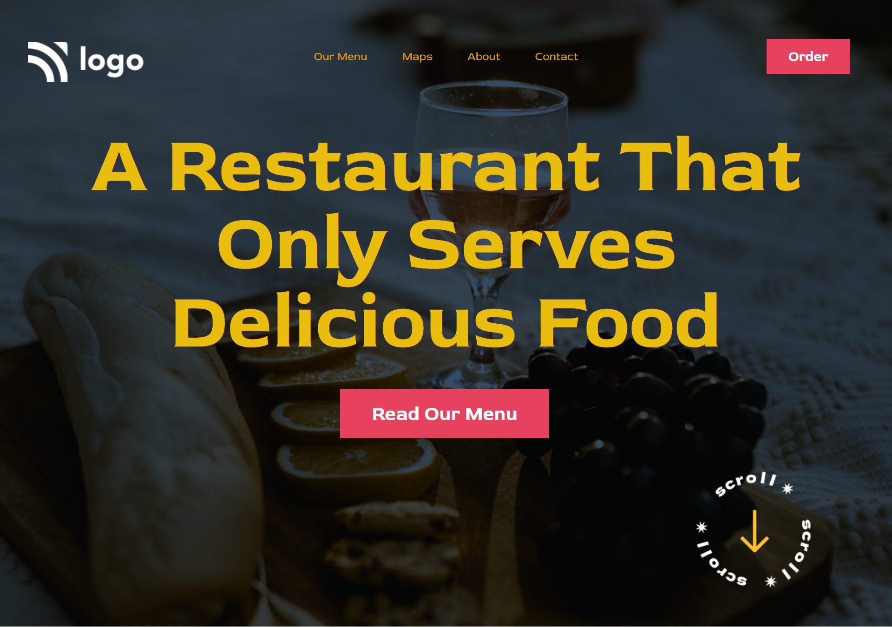

# UI Project 02 - Restaurant website

> ### **Deployed Website** :-[Live Link](https://ui-project-2.netlify.app/)
 

## Project key takeaways:

  - Used Only **Html** and **CSS**
  - I learned about flexbox.
  - I learned about the background blend mode.

   

 

> ## It took around 3 hours to complete and make this project **Mobiile** Responsive.
